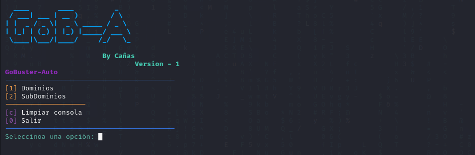

# GoB-A

GoB-A es una herraminta complementaria para GoBuster, hecha con la intención de tratar de acortarr lo más posible los tiempos de uso (ingresar unicamente datos necesarios evitando escribir comandos).

# Status

El programa se encuentra es fase beta y con un diseño básico con solo lo necesario para escanear directorios de Dominios y Sub-dominios.

# Instalation / Instalación

Proxima actualización se mejorara la interfaz, se implementaran (posiblemente) más funciones y se agilizaran los tiempos de cambio de menú.

# Proxima actualización

Se agregaran de forma nativa bancos para busqueda de directorios, subdominion y una forma más "automatizada" para la busqueda de las mismas.
